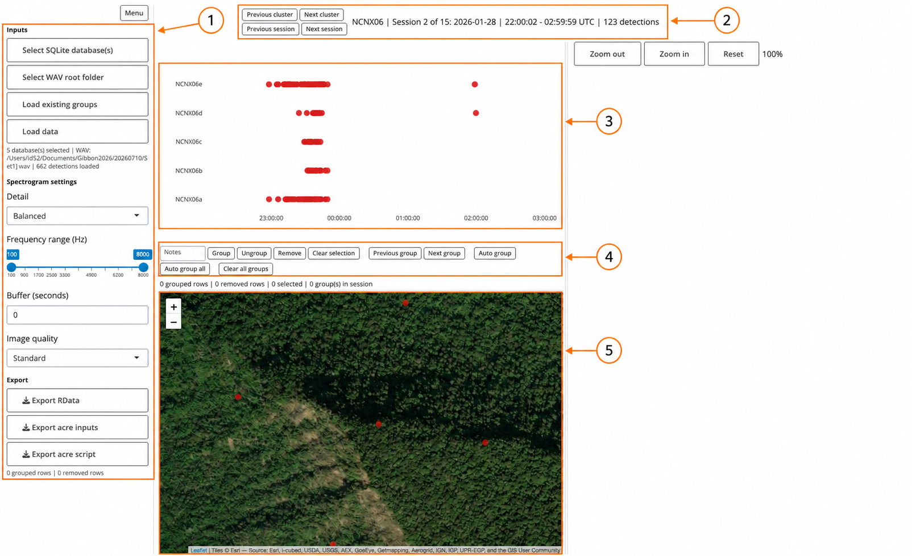
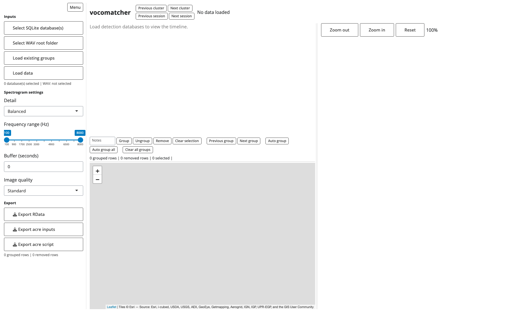
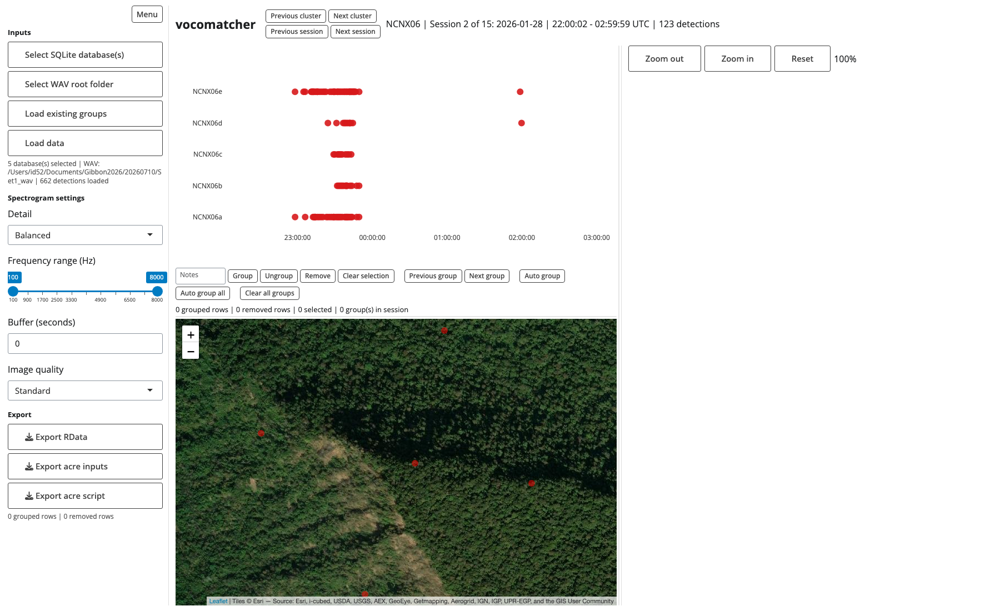

```{r setup, include=FALSE}
knitr::opts_chunk$set(
  collapse = TRUE,
  comment = "#>"
)
```

# Vocomatcher user guide

## What this app does

Vocomatcher helps you decide which detections from several autonomous recorders are the **same gibbon call**. It places detections on a common UTC timeline, shows the recorder positions and measured bearings on a map, and draws time-aligned spectrograms for selected detections. You can create and revise groups by hand or ask the app to propose groups automatically.

The main output is a record of:

- detections assigned to a call group;
- detections marked for removal;
- notes, grouping method, and suspect-bearing flags; and
- optional input files and an analysis script for the `acre` acoustic spatial capture–recapture package.

This guide describes the prototype represented by the code in this repository in August 2026.

> **The most important rule:** one group should represent one real call. A group may contain detections from several recorders, but should not contain two detections from the same call-recorder combination merely because they occur close together.

## The screen at a glance



1. **Sidebar:** choose the input files, change spectrogram settings, and export results.
2. **Navigation and session summary:** move between recorder clusters and recording sessions. The summary reports the cluster, session number, UTC interval, and detection count.
3. **Timeline:** each horizontal lane is a recorder; each dot is one detection. Time is shown in UTC.
4. **Action bar:** add notes; group, ungroup, or remove selected detections; review groups; and run automatic grouping.
5. **Map:** shows recorder locations. When detections are selected, it also shows their measured bearings.

The large panel on the right is the **spectrogram comparison panel**. It remains empty until one or more detections are selected.

## Before you start

### Software

The app has been tested with R 4.4.3 (2025-02-28). Install Vocomatcher and this manual from the project’s [GitHub repository](https://github.com/iandurbach/ecostats-rshiny). Run these commands once in R:

```r
install.packages("remotes")
remotes::install_github(
  "iandurbach/ecostats-rshiny",
  dependencies = TRUE,
  upgrade = "never",
  build_vignettes = TRUE
)
```

Then launch the app whenever you want to use it:

```r
vocomatcher::run_app()
```

Open this manual from R with:

```r
vignette("vocomatcher", package = "vocomatcher")
```

The app opens in your web browser. Keep the R process running while you work; closing it ends the app session. `upgrade = "never"` prevents installation from unexpectedly upgrading unrelated packages. If R reports that an installed dependency is too old, update that package or repeat the installation with `upgrade = "ask"`.

### Files you need

You need both of the following:

1. One or more detector SQLite databases (`.sqlite3`).
2. A WAV root folder containing the recordings referred to by those databases.

You may also load a previous Vocomatcher `.RData` export after loading the detection data.

### Expected folder arrangement

The WAV root must contain one subfolder per recorder. The subfolder name must match the recorder ID derived from the database filename.

```text
WAV root/
├── NCNX06a/
│   └── R08260128220001.wav
├── NCNX06b/
│   └── R26260128220001.wav
├── NCNX06c/
├── NCNX06d/
└── NCNX06e/
```

For example, `NCNX06a_database.sqlite3` is interpreted as recorder `NCNX06a`. Recorder IDs that share the same numeric part are treated as one recorder **cluster**: `NCNX06a` through `NCNX06e` form cluster `NCNX06`.

The app currently expects PCM WAV files with 16-, 24-, or 32-bit samples. A database must contain the detection table `Gibbon_A` or `GibbonA`, plus `Trex_Location`, `Trex_Orientation`, `Trex_Time_Offset`, and `Sound_Acquisition`.

## Quick start: the shortest successful workflow

1. Launch the app.
2. Click **Select SQLite database(s)**.
3. Navigate to the folder containing your databases, select every recorder database to be analysed together, and confirm the selection.
4. Click **Select WAV root folder** and choose the folder immediately above the recorder-specific WAV folders.
5. Click **Load data**.
6. Use **Previous/Next cluster** and **Previous/Next session** to reach the data you want to inspect.
7. Select likely matching detections on the timeline.
8. Compare their aligned spectrograms and bearing arrows.
9. Click **Group**, or use **Auto group** and review the proposal.
10. Repeat until the session has been reviewed.
11. Click **Export RData** to save work that can be reloaded later.

## Step 1: load detection and audio data

The app initially looks like this:



### Select databases

Click **Select SQLite database(s)**. In the file chooser:

1. Navigate through the folders.
2. Select all relevant `.sqlite3` files. Multiple selection is allowed.
3. Confirm the choice.

The small status line beneath **Load data** updates to show the number of selected databases.

Choose all recorders that should appear together. Loading only some recorders is allowed, but calls detected only by omitted recorders cannot be considered during grouping.

### Select the WAV root

Click **Select WAV root folder**, choose the common parent folder, and confirm it. Do not choose an individual recorder folder such as `NCNX06a`; choose its parent.

The status line displays the selected WAV path. A valid folder is required even though the spectrograms are generated only after you select detections.

### Load

Click **Load data**. Wait for the confirmation notification. A successful load populates the timeline and map and reports the number of detections in the sidebar.

For the supplied example set, the run used for this guide loaded five databases and **662 detections**. It opened cluster `NCNX06`, session 2 of 15, containing 123 detections:



Loading a new dataset clears the current in-memory grouping, removal, selection, suspect-bearing, and zoom state. Export work before replacing the data.

### If loading fails

Check these common causes:

- **“Select at least one SQLite detection database”**: no database selection was confirmed.
- **“Select a valid WAV root folder”**: no folder was selected, or it no longer exists.
- **Missing database table/column**: the database does not have the expected detector schema.
- **No recording sessions found**: `Sound_Acquisition` does not contain usable Start/Stop pairs.
- **No detector clusters found**: the database filenames do not contain a numeric cluster identifier.
- **WAV file not found** when selecting a point: the chosen root, recorder subfolder, or WAV filename does not match the database.

## Step 2: understand the loaded workspace

### Timeline

The y-axis lists recorder IDs and the x-axis is UTC time. Dot appearance indicates state:

- **red:** active and not yet grouped;
- **pale green:** already grouped;
- **very pale grey:** marked as removed;
- **larger with a black outline:** currently selected. Its fill still reflects whether it is active, grouped, or removed.

Hover over a dot to see its detection ID, recorder ID, and UTC time. Grouped points also show the group label.

### Map

Red circles show recorder positions from `Trex_Location`. Selecting detections adds bearing arrows originating at their recorders.

- A **red arrow** is an ordinary measured bearing.
- A **grey arrow** has been marked as a suspect bearing.

Click a selected detection’s arrow on the map to toggle its suspect-bearing flag. Click it again to restore it. This flag is exported and automatic grouping excludes the suspect bearing from its directional evidence; it does not delete the detection or discard its timing information.

Use the map’s **+** and **−** controls to change map scale, and drag to pan.

### Spectrogram panel

Selecting one or more points generates stacked, time-aligned spectrograms in the right panel. The same horizontal coordinate represents the same UTC time in every row, making echoes, offsets, and genuinely matching call structure easier to compare.

The spectrogram title/labels identify the detections and recorders. If the panel displays an error rather than an image, first check the WAV-root layout and filenames.

### Resize or hide panes

- Drag the **vertical grey divider** to change the width of the timeline/map side versus the spectrogram side.
- Drag the **horizontal grey divider** between timeline and map to change their heights.
- Double-click either divider to reset its size.
- Click **Menu** to collapse or restore the sidebar.

Pane sizes are remembered in that browser using local storage.

## Step 3: navigate and zoom

### Move between clusters and sessions

Use:

- **Previous cluster / Next cluster** to move among recorder arrays inferred from database filenames;
- **Previous session / Next session** to move among recording sessions in the current cluster.

A recording session is a continuous set of recording intervals. Gaps of no more than 30 minutes are joined; a larger gap starts a new session. The header always reports the current cluster, session index, UTC start and stop, and number of detections.

Navigation is bounded: clicking Previous on the first item or Next on the last item leaves you where you are. Changing cluster or session clears the current selection and review view, but it does **not** erase groups already created elsewhere.

### Zoom the timeline

- Scroll over the timeline to zoom in or out.
- Drag horizontally to pan after zooming.
- Plotly’s small mode bar appears on hover and supplies additional view tools.

Timeline zoom matters to **Auto group**: the algorithm begins at or after the current visible start time. This lets you work progressively through a long session.

### Zoom spectrograms

Use **Zoom in**, **Zoom out**, and **Reset** above the spectrogram panel. The displayed percentage reports the current scale.

Keyboard shortcuts work when the page has focus:

- `Ctrl`/`Cmd` + `+`: zoom in;
- `Ctrl`/`Cmd` + `-`: zoom out;
- `Ctrl`/`Cmd` + `0`: reset.

At more than 100%, scroll within the spectrogram panel to inspect the full image.

## Step 4: select detections

There are two ways to select points:

1. **Click** a dot to toggle that one detection on or off.
2. **Drag a rectangle** over an area of the timeline to add every enclosed detection.

Rectangle selections are cumulative: a new drag adds to the existing selection. Click **Clear selection** when you want to start again.

The action status line reports the number of selected detections. Selection drives all of the following at once:

- the black-outlined points on the timeline;
- bearing arrows on the map;
- the aligned spectrogram panel; and
- the targets of **Group** and **Remove**.

Practical selection method:

1. Zoom to a short time window.
2. Drag across near-simultaneous points on several recorder lanes.
3. Inspect the aligned spectrograms.
4. Inspect the map bearings.
5. Click individual points to add or remove borderline detections.

## Step 5A: group calls manually

### Create a new group

1. Select all detections believed to represent one real call.
2. Optionally enter a short note in the **Notes** box, for example `clear match` or `b recorder weak`.
3. Click **Group**.

The app assigns the next available integer group ID, records the grouping method as `manual`, changes the points to the grouped colour, and clears them from the action selection. The new group becomes the current review group.

### Add detections to an existing group

1. Select one or more members of the existing group.
2. Also select the ungrouped detections to add.
3. Click **Group**.

The app adds the new detections to that group and retains the group’s original method (`manual` or `automated`). You cannot combine points from two different existing groups in one operation; the app warns you if the selection spans multiple groups.

### Ungroup

Select a member of one group and click **Ungroup**. This removes the **entire group assignment**, not just the selected member. The detections become active/unassigned again.

If you are reviewing a group with **Previous group** or **Next group**, you can click **Ungroup** without selecting it again; the reviewed group is used.

### Mark false or unusable detections

1. Select the detections.
2. Optionally enter a note such as `false positive`, `rain`, or `truncated`.
3. Click **Remove**.

Removed detections are taken out of any group and displayed in pale grey. “Remove” means excluded from grouping/acre input, not deleted from the source database. Selecting a removed point and grouping it again restores it to active use.

### Clear all groups in one session

Click **Clear all groups**, read the confirmation dialog, and confirm. This clears group assignments only in the current session. Removed detections are retained. This operation cannot be undone inside the app, so export a checkpoint first if needed.

## Step 5B: group calls automatically

Automatic grouping is designed as a proposal-and-review workflow.

### Propose the next group

1. Navigate to a session.
2. Optionally zoom or pan so the left edge of the timeline is where review should begin.
3. Click **Auto group**.

The app finds the first eligible proposed group at or after the visible start time, assigns it a new group ID with method `automated`, selects its members, and zooms to a roughly two-minute review window around it. The timeline, map bearings, and spectrograms are then ready for inspection.

Review the proposal immediately:

- accept it by moving on with **Auto group**;
- add a missed detection by selecting it with a group member and clicking **Group**;
- reject the proposal with **Ungroup**;
- remove a false detection with **Remove**; or
- click a map arrow to flag a suspect bearing.

Repeated clicks on **Auto group** progress through later proposals. Existing manual groups, earlier automatic groups, and removed detections are not overwritten.

### Propose every eligible group in the session

Click **Auto group all** to create all currently eligible proposals in the current session at once. This is faster, but you should still review them with **Previous group** and **Next group**.

### What the automatic method considers

The current algorithm:

- considers detections close in corrected arrival time;
- allows at most one detection from each recorder in a candidate group;
- searches candidate groups spanning no more than 8 seconds and containing up to 5 detections;
- scores temporal compactness, with a default time scale of 2.5 seconds;
- gives a modest bonus to larger, compact groups; and
- when valid recorder locations and non-suspect bearings are available, adds a bearing-consistency score based on how well rays intersect.

It then solves a set-packing problem: chosen groups cannot share a detection. This is a ranking/proposal mechanism, not proof that calls match. Clock correction, echoes, missed detections, poor bearings, and simultaneous calling can all require manual judgement.

### Review groups

Use **Previous group** and **Next group** to step through the groups belonging to the current session. The app selects each group and zooms the timeline around it. The status line displays the current group ID and the number of groups in the session.

## Step 6: adjust spectrogram settings

Settings in the sidebar are applied when the comparison image is generated or regenerated.

### Detail

- **Time detail** uses a 512-sample analysis window. It separates brief changes in time better but gives coarser frequency detail.
- **Balanced** uses 1,024 samples and is the default.
- **Frequency detail** uses 2,048 samples. It separates close frequencies better but smooths timing.

This is the standard time–frequency trade-off of a short-time Fourier transform. The app uses a Hann window with 75% overlap and plots magnitude on a decibel scale using a common colour range across selected rows.

### Frequency range

Drag the two handles to restrict the displayed band between 100 and 8,000 Hz. Narrowing the range can make the gibbon-call band easier to compare and removes irrelevant low- or high-frequency energy from view.

### Buffer (seconds)

The default, `0`, displays the detected interval only. Enter a non-negative value to add that many seconds before **and** after each detection. Buffer is useful when detector boundaries clip a call or when you need surrounding context. At the beginning of a WAV file, the buffer is limited to available audio.

### Image quality

- **Standard:** 1× rendering; quickest and smallest.
- **High:** 2× linear resolution.
- **Very high:** 3× linear resolution.

Higher quality affects rendering time and memory, not the underlying audio or grouping result. Use Standard while screening and raise quality when close visual comparison is necessary.

## Step 7: save, resume, and export

### Export RData — your resumable checkpoint

Click **Export RData**. The browser downloads a timestamped file such as:

```text
detection_groups_20260817_143000.RData
```

It contains two R objects:

- `groups`: one row per grouped detection, including `group_ID`, `grouping_method`, `Notes`, and `suspect_bearing` alongside detection information;
- `removed_points`: detections marked as removed, including notes and suspect-bearing state.

Save checkpoints regularly and keep the original databases unchanged alongside them.

### Work in short bouts

You do not need to finish every session in a recorder cluster at once. A cluster may contain many recording sessions, so a practical workflow is to review a few sessions, save a checkpoint, close the app, and resume later.

#### At the start of the first bout

1. Select all SQLite databases for the recorder cluster.
2. Select the matching WAV root folder.
3. Click **Load data**.
4. Work through sessions in order using **Next session**.
5. Fully review each session before moving on: check automatic groups, manual groups, removed detections, notes, and suspect bearings.

#### Before stopping

1. Finish or make a note of the session currently being reviewed.
2. Click **Export RData**.
3. Wait for the timestamped `detection_groups_*.RData` file to download successfully.
4. Keep this latest checkpoint with the databases, or in a clearly named results folder.
5. Only then close the browser tab and stop the R app.

The RData export is the saved state of your grouping work. Closing the app without exporting loses changes made since the previous export.

It is useful to keep a tiny external work log alongside the checkpoint, for example:

```text
Checkpoint: detection_groups_20260818_154500.RData
Cluster: NCNX06
Completed sessions: 1–5
Resume at: session 6
```

Alternatively, rename or copy the downloaded checkpoint to include the cluster and last completed session, while retaining the `.RData` extension:

```text
NCNX06_through_session_05.RData
```

#### At the start of the next bout

The order is important:

1. Launch Vocomatcher again with `vocomatcher::run_app()`.
2. Click **Select SQLite database(s)** and select the **same cluster databases** used previously.
3. Click **Select WAV root folder** and select the same matching WAV root.
4. Click **Load data** and wait for the detections to appear.
5. Click **Load existing groups**.
6. Select the **most recent RData checkpoint** from the previous bout.
7. Wait for the notification confirming how many groups and removed detections were restored.
8. Use **Next session** to return to the first unfinished session recorded in your work log or checkpoint filename.
9. Confirm that earlier grouped detections appear pale green and removed detections appear pale grey.
10. Continue reviewing, then export a new checkpoint before stopping again.

> **Do not click “Load existing groups” before “Load data.”** The app must first recreate the detections from the databases so that it can match the saved group and removal records back to them.

Loading a checkpoint restores the scientific decisions saved in `groups` and `removed_points`, including notes, manual/automated method labels, and suspect-bearing flags. It does **not currently restore** the last displayed cluster or session, timeline zoom, selected points, spectrogram zoom, or spectrogram settings. You must navigate back to the first unfinished session yourself; this is why a short work log or informative checkpoint filename is helpful.

After restoration, **Auto group** and **Auto group all** protect detections that are already grouped or removed. New groups continue with IDs above the highest restored group ID, so resuming does not overwrite the work from earlier bouts.

Repeat this save–close–reload cycle until every session in the cluster has been reviewed. After the final session, create one final RData export and label it clearly as the completed cluster result.

### Resume from an RData checkpoint

Loading groups is a two-stage process because saved rows must be matched against the current detections:

1. Select the same SQLite databases and WAV root.
2. Click **Load data** and wait for it to finish.
3. Click **Load existing groups**.
4. Select the previous `.RData` file.

The file must contain `groups`; `removed_points` is optional for compatibility with older exports. The app rejects duplicate memberships, detections that do not match the loaded data, and any detection marked both grouped and removed.

### Export acre inputs

Click **Export acre inputs** to download a timestamped `acre_inputs_*.RData` bundle for acoustic spatial capture–recapture analysis.

The bundle includes five R objects:

- `captures`: all non-removed detections, with grouped detections sharing a capture ID and ungrouped detections represented as singleton IDs;
- `traps`: recorder locations converted from longitude/latitude to UTM x/y coordinates;
- `sessions`: the app-to-acre session lookup and timing metadata;
- `survey.length`: recording-session durations in seconds; and
- `metadata`: UTM details, recorder and capture lookup tables, source database paths, and export notes.

Known auxiliary measurements—time of arrival and bearing—are retained. The app does not invent signal strength or source-to-recorder distance. Export is disabled until suitable data are loaded and fails if a non-removed detection lies outside a recording session.

### Export acre script

Click **Export acre script** to download `fit_acre_*.R`. Put it beside the acre-input RData file. The script installs neither R nor packages; it expects the non-CRAN `acre` package and its dependencies to be available. Read and adapt its model settings before treating results as final.

The generated script loads the bundle, builds the required acre data, creates a buffered mask, fits a basic model with `fit.acre`, and prints the result. Its default input filename is `acre_inputs.RData`, so either rename the downloaded bundle or edit the script to use its timestamped name.

## A recommended review routine

For careful, reproducible work:

1. Load every recorder in one cluster and verify the detection count.
2. Start with the first session containing detections.
3. Keep spectrogram settings at Balanced, 100–8,000 Hz, buffer 0 for the first pass.
4. Click **Auto group**.
5. Compare timing and spectrogram shape.
6. Check whether bearings are plausible; flag unreliable arrows.
7. Add, remove, or ungroup points as needed.
8. Add concise notes only when they convey useful review information.
9. Repeat **Auto group** until no proposal remains.
10. Use **Previous group / Next group** for a second pass.
11. Review ungrouped red points and false detections.
12. Export an RData checkpoint.
13. Move to the next session, then the next cluster.
14. At the end, export a final RData file and, if required, the acre bundle and script.

## Troubleshooting and cautions

### Spectrograms are blank or show an error

- Confirm that the WAV root contains recorder-named subfolders.
- Confirm that database `SystemName` values exactly match WAV filenames.
- Confirm the WAV is PCM and uses a supported bit depth.
- Confirm the detection time falls inside a Start/Stop recording interval.

### The wrong calls appear aligned

The database time offset nearest each detection is applied to standardise arrival time. Check `Trex_Time_Offset` and UTC conventions if alignment is systematically wrong. The app treats database timestamps as UTC.

### Map arrows do not appear

Arrows appear only for selected detections with usable recorder locations and bearings. Check `Trex_Location`, `Trex_Orientation`, and the detector’s bearing field. A recorder’s absolute bearing is calculated from its median true heading plus its relative detection angle, normalised to 0–360°.

### Auto group finds nothing

There may be no eligible multi-recorder candidate after the visible start, or possible partners may already be grouped/removed. Pan left, inspect red points, and try again. A genuine call detected by only one recorder remains ungrouped unless handled downstream as a singleton in the acre export.

### A button appears to do nothing

Read the notification in the browser and the status line below the action bar. Most actions require loaded data, a selection, or at least one existing group in the session.

### Browser refresh or app shutdown

Grouping state lives in the current Shiny session until exported. Refreshing, closing the tab, stopping R, or loading a new dataset can lose unexported work. Use **Export RData** often.

## Feature reference

| Control | Effect | Scope |
|---|---|---|
| Menu | Collapse/restore sidebar | Browser view |
| Select SQLite database(s) | Choose one or more detection databases | Next load |
| Select WAV root folder | Choose common audio parent folder | Next/current load |
| Load existing groups | Import `groups` and optional `removed_points` | Loaded dataset |
| Load data | Parse databases, sessions, locations, offsets, and recordings | Whole workspace |
| Detail | Change spectrogram time/frequency resolution | Spectrogram rendering |
| Frequency range | Limit plotted frequencies | Spectrogram rendering |
| Buffer | Add audio before and after each detection | Spectrogram rendering |
| Image quality | Render at 1×, 2×, or 3× | Spectrogram rendering |
| Previous/Next cluster | Change recorder cluster | View |
| Previous/Next session | Change recording session | View |
| Notes | Attach text to the next Group or Remove action | Selected detections |
| Group | Create a group or add to one selected group | Selection |
| Ungroup | Delete one selected/reviewed group assignment | Whole group |
| Remove | Mark detections excluded and remove their groups | Selection |
| Clear selection | Deselect all points | Selection |
| Previous/Next group | Select and zoom to groups for review | Current session |
| Auto group | Create and focus the next eligible proposal | Current session/from visible start |
| Auto group all | Create all eligible proposals | Current session |
| Clear all groups | Clear group assignments after confirmation | Current session |
| Map bearing arrow | Toggle suspect-bearing flag | Selected detection |
| Zoom out/in/Reset | Scale aligned spectrogram image | Spectrogram panel |
| Export RData | Save groups and removed detections | All loaded data |
| Export acre inputs | Save analysis-ready bundle | All non-removed data |
| Export acre script | Save starter model-fitting script | Download only |
